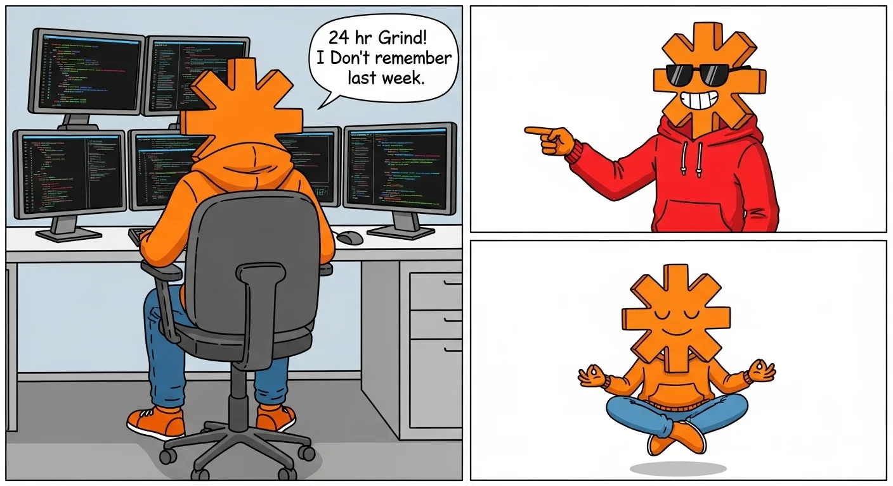
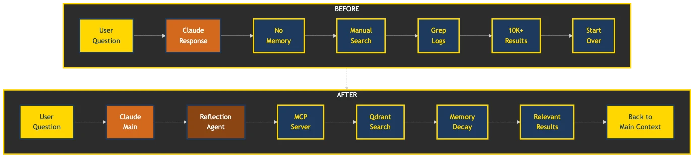
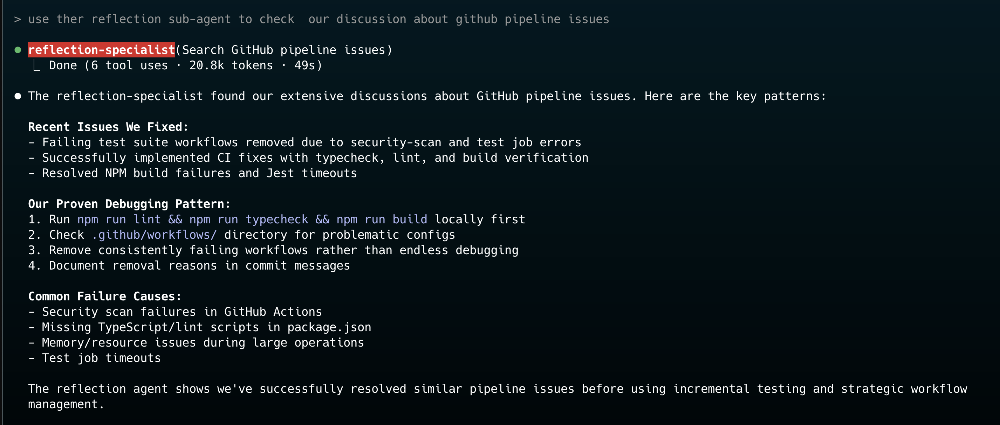

# Claude Self-Reflect

Claude forgets everything. This fixes that.

**Based on https://github.com/ramakay/claude-self-reflect**

## What You Get

Ask Claude about past conversations. Get actual answers. **100% local by default** - your conversations never leave your machine. Cloud-enhanced search available when you need it.

**Before**: "I don't have access to previous conversations"  
**After**: 
```
⏺ reflection-specialist(Search FastEmbed vs cloud embedding decision)
  ⎿ Done (3 tool uses · 8.2k tokens · 12.4s)

"Found it! Yesterday we decided on FastEmbed for local mode - better privacy, 
no API calls, 384-dimensional embeddings. Works offline too."
```

The reflection specialist is a specialized sub-agent that Claude automatically spawns when you ask about past conversations. It searches your conversation history in its own isolated context, keeping your main chat clean and focused.

Your conversations become searchable. Your decisions stay remembered. Your context persists.

## The Magic



## Before & After



## Real Examples That Made Us Build This

```
You: "What was that PostgreSQL optimization we figured out?"
Claude: "Found it - conversation from Dec 15th. You discovered that adding 
        a GIN index on the metadata JSONB column reduced query time from 
        2.3s to 45ms."

You: "Remember that React hooks bug?"
Claude: "Yes, from last week. The useEffect was missing a dependency on 
        userId, causing stale closures in the event handler."

You: "Have we discussed WebSocket authentication before?"
Claude: "3 conversations found:
        - Oct 12: Implemented JWT handshake for Socket.io
        - Nov 3: Solved reconnection auth with refresh tokens  
        - Nov 20: Added rate limiting per authenticated connection"
```

## The Secret Sauce: Sub-Agents

Here's what makes this magical: **The Reflection Specialist sub-agent**.

When you ask about past conversations, Claude doesn't search in your main chat. Instead, it spawns a specialized sub-agent that:
- Searches your conversation history in its own context
- Brings back only the relevant results
- Keeps your main conversation clean and focused

**Your main context stays pristine**. No clutter. No token waste.



## How It Works (10 Second Version)

Your conversations → Vector embeddings → Semantic search → Claude remembers

Technical details exist. You don't need them to start.

## Using It

Once installed, just talk naturally:

- "What did we discuss about database optimization?"
- "Find our debugging session from last week"
- "Remember this solution for next time"

The reflection specialist automatically activates. No special commands needed.

## Project-Scoped Search

Conversations are now **project-aware by default**. When you ask about past conversations, Claude automatically searches within your current project directory, keeping results focused and relevant.

### How It Works

```
# Example: Working in ~/projects/ShopifyMCPMockShop
You: "What authentication method did we implement?"
Claude: [Searches ONLY ShopifyMCPMockShop conversations]
        "Found 3 conversations about JWT authentication..."

# To search everywhere (like pre-v2.4.3 behavior)
You: "Search all projects for WebSocket implementations"
Claude: [Searches across ALL your projects]
        "Found implementations in 5 projects: ..."

# To search a specific project
You: "Find Docker setup in claude-self-reflect project"
Claude: [Searches only claude-self-reflect conversations]
```

### Key Behaviors

| Search Type | How to Trigger | Example |
|------------|----------------|---------|
| **Current Project** (default) | Just ask normally | "What did we discuss about caching?" |
| **All Projects** | Say "all projects" or "across projects" | "Search all projects for error handling" |
| **Specific Project** | Mention the project name | "Find auth code in MyApp project" |

## Memory Decay

Recent conversations matter more. Old ones fade. Like your brain, but reliable.

Works perfectly out of the box. [Configure if you're particular](docs/memory-decay.md).

## For the Skeptics

**"Just use grep"** - Sure, enjoy your 10,000 matches for "database"  
**"Overengineered"** - Two functions: store_reflection, reflect_on_past  
**"Another vector DB"** - Yes, because semantic > string matching

Built by developers tired of re-explaining context every conversation.

## Requirements

- **Docker Desktop** (macOS/Windows) or **Docker Engine** (Linux)
- **Claude Code** app

## MCP Setup Options

You can configure the MCP server in two ways:

### Option 1: Containerized MCP Server (Recommended)

Run the MCP server inside Docker for isolation and consistency:

```bash
# 1. Ensure Docker services are running
docker compose --profile watch --profile mcp up -d

# 2. Add containerized MCP to Claude Code
claude mcp add claude-self-reflect "/path/to/claude-self-reflect/run-mcp-docker.sh" -e QDRANT_URL="http://qdrant:6333"

# 3. Restart Claude Code to load the MCP server
```

**Benefits:**
- ✅ No local Python environment needed
- ✅ Consistent runtime environment 
- ✅ Smart model caching (downloads once, uses offline mode after)
- ✅ Automatic dependency management
- ✅ Isolated from host system

### Option 2: Local MCP Server

Run the MCP server directly on your system:

```bash
# 1. Start Qdrant and watcher services
docker compose --profile watch up -d

# 2. Add local MCP to Claude Code  
claude mcp add claude-self-reflect "/path/to/claude-self-reflect/mcp-server/run-mcp.sh" -e QDRANT_URL="http://localhost:6333"

# 3. Restart Claude Code to load the MCP server
```

**Requirements:**
- Python 3.11+
- Virtual environment setup in `mcp-server/`
- FastMCP and dependencies installed

**Note:** Both options require the watcher service to continuously import new conversations from Claude Code.

### Smart Model Caching

The containerized MCP server includes intelligent model caching:

- **First run**: Downloads model from Hugging Face (slow)
- **Subsequent runs**: Uses cached model in offline mode (fast startup)
- **Auto-refresh**: Checks for model updates after 7 days (configurable)
- **Environment variable**: Set `MODEL_CACHE_DAYS=30` for custom refresh interval

## Advanced Setup

Want to customize? See [Configuration Guide](docs/installation-guide.md).

## The Technical Stuff

If you must know:

- **Vector DB**: Qdrant (local, your data stays yours)
- **Embeddings**: FastEmbed with sentence-transformers/all-MiniLM-L6-v2 (local)
- **MCP Server**: Python + FastMCP
- **Search**: Semantic similarity with time decay
- **Import**: Continuous watcher service (60s interval)
- **Storage**: Docker volumes for data persistence

### Docker Services

The system runs three main services:

| Service | Purpose | Profile | Persistence |
|---------|---------|---------|-------------|
| **qdrant** | Vector database | (always) | `qdrant_data` volume |
| **watcher** | Continuous import | `watch` | `watcher_state` volume |
| **mcp-server** | Claude integration | `mcp` | `huggingface_cache` volume |

```bash
# Run specific service combinations
docker compose up -d                                    # Just Qdrant
docker compose --profile watch up -d                    # Qdrant + Watcher  
docker compose --profile mcp up -d                      # Qdrant + MCP Server
docker compose --profile watch --profile mcp up -d      # All services
```

Uses local FastEmbed embeddings for privacy, offline use, and no API dependencies.

### Want More Details?

- [Architecture Deep Dive](docs/architecture-details.md) - How it actually works
- [Components Guide](docs/components.md) - Each piece explained
- [Why We Built This](docs/motivation-and-history.md) - The full story
- [Advanced Usage](docs/advanced-usage.md) - Power user features

## Problems?

- [Troubleshooting Guide](docs/troubleshooting.md)
- [GitHub Issues](https://github.com/ramakay/claude-self-reflect/issues)
- [Discussions](https://github.com/ramakay/claude-self-reflect/discussions)

---

Stop reading. Start installing. Your future self will thank you.
