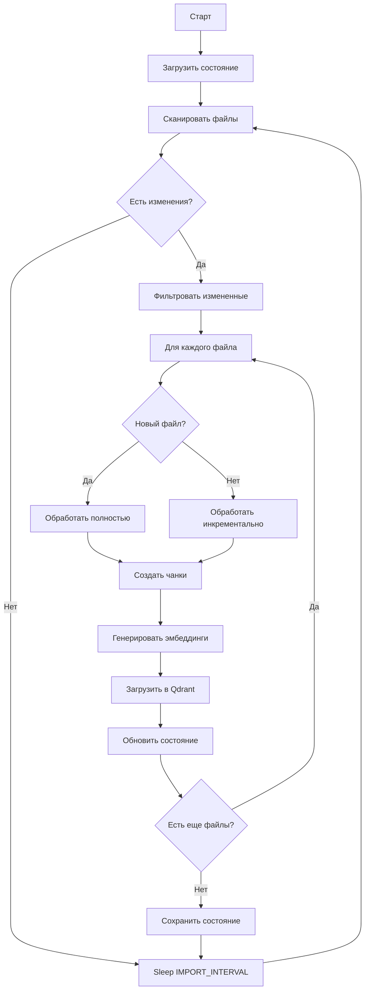

# Техническое задание: import-watcher-smart.py

## 1. Общее описание

### 1.1 Цель
Создать умный инкрементальный импортер разговоров Claude, который минимизирует использование ресурсов и время обработки через интеллектуальное кэширование и обнаружение изменений.

### 1.2 Основные преимущества
- Инкрементальная обработка только изменившихся файлов
- Кэширование состояния для быстрой проверки
- Минимальное использование памяти и CPU
- Автоматическая очистка устаревших данных

## 2. Функциональные требования

### 2.1 Мониторинг файловой системы

#### 2.1.1 Сканирование директорий
- Путь к логам: `${CLAUDE_LOGS_PATH:-~/.claude/projects}`
- Паттерн файлов: `**/*.jsonl`
- Рекурсивное сканирование всех проектов
- Поддержка символических ссылок

#### 2.1.2 Обнаружение изменений
```python
# Быстрая проверка через метаданные
- mtime (время модификации)
- size (размер файла)
- hash последних N строк (для активных сессий)

# Полная проверка через хэширование
- SHA256 для полного файла
- Сохранение в state file
```

### 2.2 Парсинг JSONL файлов

#### 2.2.1 Структура данных
```json
{
  "sessionId": "uuid",
  "timestamp": "ISO-8601",
  "type": "user|assistant",
  "message": {
    "role": "user|assistant",
    "content": "text or array"
  },
  "uuid": "message-uuid",
  "parentUuid": "parent-message-uuid",
  "cwd": "/working/directory",
  "gitBranch": "branch-name"
}
```

#### 2.2.2 Фильтрация сообщений
- Игнорировать мета-сообщения (`"isMeta": true`)
- Игнорировать системные команды (`/clear`, `/exit`)
- Обрабатывать только сообщения с контентом

### 2.3 Чанкирование разговоров

#### 2.3.1 Алгоритм разбиения
```python
CHUNK_SIZE = int(os.getenv('CHUNK_SIZE', '10'))  # сообщений в чанке

def create_chunks(messages):
    chunks = []
    current_chunk = []
    
    for msg in messages:
        current_chunk.append(msg)
        
        # Создать чанк если:
        # 1. Достигнут размер CHUNK_SIZE
        # 2. Смена типа (user -> assistant)
        # 3. Большой временной разрыв (> 30 минут)
        
        if should_create_chunk(current_chunk):
            chunks.append(finalize_chunk(current_chunk))
            current_chunk = []
    
    return chunks
```

#### 2.3.2 Метаданные чанка
```python
{
    "project_name": "extracted_from_path",
    "session_id": "uuid",
    "chunk_id": "generated_uuid",
    "timestamp": "first_message_timestamp",
    "messages_count": 10,
    "tokens_estimate": 1500,
    "git_branch": "main",
    "working_directory": "/path"
}
```

### 2.4 Векторизация и индексация

#### 2.4.1 Генерация эмбеддингов
```python
# Использовать FastEmbed для локальных эмбеддингов
from fastembed import TextEmbedding

model = TextEmbedding(model_name="sentence-transformers/all-MiniLM-L6-v2")

def generate_embedding(chunk_text):
    # Объединить все сообщения в чанке
    combined_text = " ".join([msg['content'] for msg in chunk['messages']])
    
    # Ограничить длину для модели (max 512 токенов)
    truncated_text = truncate_to_tokens(combined_text, max_tokens=512)
    
    # Получить эмбеддинг
    embedding = model.embed([truncated_text])[0]
    return embedding.tolist()
```

#### 2.4.2 Хранение в Qdrant
```python
from qdrant_client import QdrantClient
from qdrant_client.models import PointStruct, VectorParams, Distance

client = QdrantClient(url=QDRANT_URL)

def store_chunk(chunk, embedding):
    collection_name = f"conv_{project_hash}_local"
    
    # Создать коллекцию если не существует
    ensure_collection(collection_name, vector_size=384)
    
    # Подготовить точку
    point = PointStruct(
        id=generate_point_id(chunk),
        vector=embedding,
        payload={
            "content": chunk['combined_text'],
            "timestamp": chunk['timestamp'],
            "session_id": chunk['session_id'],
            "chunk_id": chunk['chunk_id'],
            "messages_count": chunk['messages_count']
        }
    )
    
    # Загрузить в Qdrant
    client.upsert(collection_name, points=[point])
```

### 2.5 Управление состоянием

#### 2.5.1 State файл
```json
{
  "version": "1.0",
  "last_scan": "2025-08-07T12:00:00Z",
  "files": {
    "/path/to/file.jsonl": {
      "mtime": 1234567890,
      "size": 102400,
      "hash": "sha256_hash",
      "last_processed": "2025-08-07T11:00:00Z",
      "chunks_count": 15,
      "lines_processed": 150
    }
  },
  "collections": {
    "conv_abc123_local": {
      "created": "2025-08-07T10:00:00Z",
      "points_count": 1500,
      "last_updated": "2025-08-07T11:00:00Z"
    }
  }
}
```

#### 2.5.2 Инкрементальная обработка
```python
def process_incremental():
    state = load_state()
    current_files = scan_files()
    
    for file_path in current_files:
        file_info = get_file_info(file_path)
        
        # Пропустить если не изменился
        if file_path in state['files']:
            if not has_changed(file_info, state['files'][file_path]):
                continue
        
        # Обработать только новые строки
        if file_path in state['files']:
            start_line = state['files'][file_path]['lines_processed']
            process_file_partial(file_path, start_line)
        else:
            process_file_full(file_path)
        
        # Обновить состояние
        update_state(file_path, file_info)
```

### 2.6 Оптимизации производительности

#### 2.6.1 Батчевая обработка
```python
BATCH_SIZE = int(os.getenv('BATCH_SIZE', '100'))

def process_in_batches(items):
    for i in range(0, len(items), BATCH_SIZE):
        batch = items[i:i+BATCH_SIZE]
        
        # Параллельная генерация эмбеддингов
        embeddings = model.embed(batch)
        
        # Батчевая загрузка в Qdrant
        client.upsert(collection_name, points=batch_points)
```

#### 2.6.2 Кэширование
```python
# In-memory кэш для активных сессий
active_sessions_cache = {}

# Кэш эмбеддингов для дедупликации
embeddings_cache = LRUCache(maxsize=1000)

# Кэш хэшей файлов
file_hash_cache = {}
```

#### 2.6.3 Параллельная обработка
```python
MAX_PARALLEL = int(os.getenv('MAX_PARALLEL_HASHES', '5'))

from concurrent.futures import ThreadPoolExecutor

with ThreadPoolExecutor(max_workers=MAX_PARALLEL) as executor:
    futures = []
    for file_path in files_to_process:
        future = executor.submit(process_file, file_path)
        futures.append(future)
    
    # Собрать результаты
    for future in futures:
        result = future.result()
```

### 2.7 Обработка ошибок

#### 2.7.1 Retry логика
```python
import backoff

@backoff.on_exception(
    backoff.expo,
    (ConnectionError, TimeoutError),
    max_tries=3,
    max_time=60
)
def upload_to_qdrant(points):
    return client.upsert(collection_name, points=points)
```

#### 2.7.2 Graceful degradation
```python
def safe_process_file(file_path):
    try:
        return process_file(file_path)
    except JSONDecodeError:
        logger.warning(f"Corrupted JSON in {file_path}, skipping")
        return None
    except Exception as e:
        logger.error(f"Failed to process {file_path}: {e}")
        # Продолжить с другими файлами
        return None
```

## 3. Нефункциональные требования

### 3.1 Производительность
- Первичная индексация: < 100 файлов/минуту
- Инкрементальное обновление: < 5 секунд для проверки 1000 файлов
- Использование памяти: < 500MB
- CPU использование: < 1 ядро в среднем

### 3.2 Надежность
- Автоматическое восстановление после сбоев
- Сохранение состояния каждые 10 обработанных файлов
- Валидация данных перед записью
- Логирование всех критических операций

### 3.3 Масштабируемость
- Поддержка до 100,000 файлов
- Поддержка до 10 миллионов векторов
- Работа с файлами до 100MB

## 4. Переменные окружения

```bash
# Основные настройки
QDRANT_URL=http://qdrant:6333
LOGS_DIR=/logs
STATE_FILE=/app/state/watcher-state.json

# Интервалы
IMPORT_INTERVAL=60                  # Секунды между проверками
FORCE_FULL_CHECK_INTERVAL=3600      # Полная проверка раз в час
QUICK_CHECK_ONLY=false              # Только быстрая проверка

# Производительность
BATCH_SIZE=100                      # Размер батча для векторизации
CHUNK_SIZE=10                       # Сообщений в чанке
MAX_PARALLEL_HASHES=5               # Параллельных хэшей

# Логирование
LOG_LEVEL=INFO
LOG_STATS_EVERY=10                  # Статистика каждые N файлов
VERBOSE_CHECKS=false                # Детальное логирование проверок
```

## 5. Структура проекта

```
/scripts/import-watcher-smart.py
├── main()                          # Точка входа
├── WatcherState                    # Класс управления состоянием
├── FileProcessor                   # Обработка JSONL файлов
├── ChunkGenerator                  # Создание чанков
├── EmbeddingService                # Генерация эмбеддингов
├── QdrantService                   # Взаимодействие с Qdrant
└── utils/
    ├── hash_utils.py               # Хэширование файлов
    ├── json_parser.py              # Парсинг JSONL
    └── performance.py              # Метрики и профилирование
```

## 6. Алгоритм работы



## 7. Критерии приемки

1. **Корректность**
   - Все сообщения импортируются без потерь
   - Дедупликация работает корректно
   - Метаданные сохраняются полностью

2. **Производительность**
   - Инкрементальная проверка < 5 сек для 1000 файлов
   - Использование памяти < 500MB
   - CPU < 100% одного ядра

3. **Надежность**
   - Восстановление после сбоев
   - Корректная обработка битых файлов
   - Атомарность операций

4. **Мониторинг**
   - Логирование всех операций
   - Метрики производительности
   - Статистика обработки

## 8. Примеры использования

### 8.1 Запуск в Docker
```bash
docker compose --profile watch up -d watcher
```

### 8.2 Локальный запуск
```bash
export QDRANT_URL=http://localhost:6333
export LOGS_DIR=~/.claude/projects
python scripts/import-watcher-smart.py
```

### 8.3 Отладка
```bash
export LOG_LEVEL=DEBUG
export VERBOSE_CHECKS=true
export LOG_STATS_EVERY=1
python scripts/import-watcher-smart.py
```

## 9. Тестирование

### 9.1 Unit тесты
- Парсинг JSONL
- Создание чанков
- Генерация эмбеддингов
- Управление состоянием

### 9.2 Интеграционные тесты
- Полный цикл импорта
- Инкрементальные обновления
- Восстановление после сбоев
- Работа с Qdrant

### 9.3 Нагрузочные тесты
- 10,000 файлов
- 1,000,000 сообщений
- Параллельная обработка
- Мониторинг ресурсов