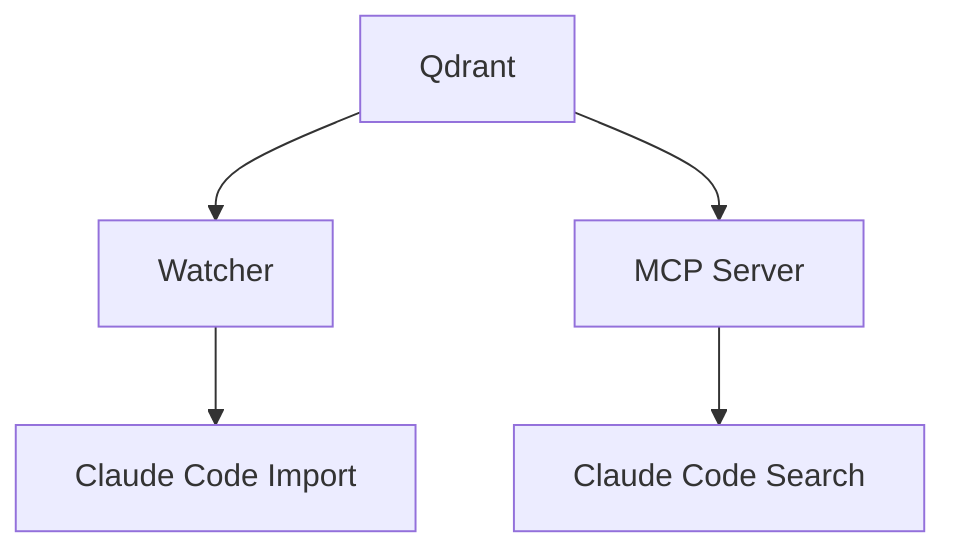

# Components Deep Dive

Detailed exploration of each system component and their interactions.

## 1. Qdrant Vector Database

### Overview
Qdrant is a high-performance vector similarity search engine that serves as our memory backend. We chose Qdrant for:
- **Local Operation**: Runs entirely on your machine
- **Performance**: Sub-100ms searches at scale
- **Persistence**: Automatic data durability
- **API Quality**: Excellent Python client support

### Configuration
```yaml
# docker-compose.yaml
volumes:
  qdrant_data:

services:
  qdrant:
    image: qdrant/qdrant:v1.15.1
    container_name: claude-reflection-qdrant
    ports:
      - "${QDRANT_PORT:-6333}:6333"
    volumes:
      - qdrant_data:/qdrant/storage
    environment:
      - QDRANT__LOG_LEVEL=INFO
      - QDRANT__SERVICE__HTTP_PORT=6333
    restart: unless-stopped
    mem_limit: ${QDRANT_MEMORY:-1g}
    memswap_limit: ${QDRANT_MEMORY:-1g}
```

### Data Model
Each conversation chunk is stored as a vector point:
```json
{
  "id": "unique-uuid-here",
  "vector": [384 float values],  // FastEmbed all-MiniLM-L6-v2
  "payload": {
    "text": "conversation text chunk",
    "timestamp": "2024-08-07T15:30:00Z",
    "project": "/home/user/project-name",
    "conversation_id": "claude-conversation-uuid",
    "chunk_index": 0,
    "start_role": "user",
    "role": "user",
    "file_path": "path/to/conversation.jsonl"
  }
}
```

### Collection Strategy
**Project-Based Collections**:
```
conv_a1b2c3d4_local  # Hash of project path + "_local" suffix
conv_e5f6g7h8_local  # Different project
reflections_local    # User-stored insights
collection_metadata_local  # Collection metadata
```

**Benefits**:
- **Isolation**: Projects don't interfere with each other
- **Performance**: Smaller search spaces = faster queries
- **Privacy**: Work conversations separate from personal

### Performance Tuning
**HNSW Index Parameters** (default Qdrant settings):
- `m`: 16 (connectivity)
- `ef_construct`: 100 (index build quality)
- `ef`: 128 (search quality vs speed)

**Memory Usage**:
- ~400 bytes per vector (384 dims + metadata)
- 1000 conversations ≈ 40MB
- 10,000 conversations ≈ 400MB

## 2. Watcher Service

### Overview
Continuous import service that monitors Claude Code conversations and imports new/changed files automatically.

### Architecture
```python
# Simplified watcher flow
while True:
    files = scan_directory(CLAUDE_LOGS_PATH)
    for file in files:
        if file_changed(file):
            import_conversation(file)
    sleep(IMPORT_INTERVAL)
```

### Configuration
```yaml
# docker-compose.yaml
watcher:
  build:
    context: .
    dockerfile: Dockerfile.watcher
  container_name: claude-reflection-watcher
  volumes:
    - ${CLAUDE_LOGS_PATH:-~/.claude/projects}:/logs:ro
    - ./config:/config:ro
    - ./scripts:/scripts:ro
    - watcher_state:/app/state
  environment:
    - QDRANT_URL=http://qdrant:6333
    - LOGS_DIR=/logs
    - STATE_FILE=/app/state/watcher-state.json
    - IMPORT_INTERVAL=60
    - BATCH_SIZE=100
    - CHUNK_SIZE=10
  profiles: ["watch"]
```

### State Management
**State File** (`/app/state/watcher-state.json`):
```json
{
  "files": {
    "/logs/project1/conversation1.jsonl": {
      "hash": "sha256-hash-of-content",
      "last_modified": "2024-08-07T15:30:00Z",
      "imported_chunks": 5,
      "last_import": "2024-08-07T15:30:00Z"
    }
  },
  "statistics": {
    "total_scans": 1234,
    "files_processed": 567,
    "chunks_imported": 8901,
    "last_scan": "2024-08-07T15:30:00Z"
  }
}
```

### Change Detection
**SHA-256 Based**:
- Hash entire file content
- Compare with stored hash
- Only import if changed
- Deduplication prevents re-processing

### Processing Pipeline
1. **Scan**: Find all `.jsonl` files in logs directory
2. **Filter**: Check modification times vs state
3. **Parse**: Extract messages from JSONL format
4. **Chunk**: Split long conversations (~500 tokens)
5. **Embed**: Generate FastEmbed vectors (384-dim)
6. **Store**: Insert into appropriate Qdrant collection
7. **Update**: Record new hashes and metadata

### Error Handling
- **File Locks**: Skip files in use by Claude Code
- **Parse Errors**: Log and continue with other files
- **Network Errors**: Retry Qdrant operations
- **Resource Limits**: Batch processing to prevent OOM

## 3. MCP Server

### Overview
Python-based MCP server using FastMCP framework that provides memory tools to Claude Code.

### Configuration
```yaml
# docker-compose.yaml
mcp-server:
  build:
    context: .
    dockerfile: Dockerfile.mcp-server
  container_name: claude-reflection-mcp
  volumes:
    - huggingface_cache:/home/mcpuser/.cache/huggingface
  environment:
    - QDRANT_URL=http://qdrant:6333
    - ENABLE_MEMORY_DECAY=true
    - DECAY_WEIGHT=0.3
    - DECAY_SCALE_DAYS=90
    - MODEL_CACHE_DAYS=7
  profiles: ["mcp"]
```

### Tools Provided

#### `reflect_on_past`
**Purpose**: Search past conversations semantically
**Parameters**:
```python
reflect_on_past(
    query: str,           # Search query
    limit: int = 5,       # Max results
    min_score: float = 0.7,  # Similarity threshold
    use_decay: int = -1,  # Memory decay (-1=default, 0=off, 1=on)
    project: str = None   # Project filter (None=current, 'all'=all)
)
```

#### `store_reflection`
**Purpose**: Store important insights for future reference
**Parameters**:
```python
store_reflection(
    content: str,         # The insight to store
    tags: List[str] = [], # Categorization tags
    project: str = None   # Target project
)
```

### FastEmbed Integration

**Model**: `sentence-transformers/all-MiniLM-L6-v2`
- **Dimensions**: 384
- **Performance**: ~100ms per 500-token chunk
- **Quality**: Good semantic understanding
- **Size**: ~90MB download

**Smart Caching**:
```python
def is_model_fresh(model_name, cache_dir, max_age_days=7):
    timestamp_file = cache_dir / model_name / ".timestamp"
    if not timestamp_file.exists():
        return False
    
    age_days = (time.time() - float(timestamp_file.read_text())) / 86400
    return age_days <= max_age_days
```

**Cache Strategy**:
- **First Run**: Download model, create timestamp
- **Subsequent**: Use cached model if < 7 days old
- **Refresh**: Auto-update models weekly
- **Offline**: Full offline mode after cache

### Memory Decay Implementation

**Exponential Decay Formula**:
```python
import numpy as np
from datetime import datetime, timezone

def apply_memory_decay(results, decay_weight=0.3, decay_scale_days=90):
    now = datetime.now(timezone.utc)
    scale_ms = decay_scale_days * 24 * 60 * 60 * 1000
    
    decayed_results = []
    for result in results:
        # Parse timestamp
        timestamp = datetime.fromisoformat(result.timestamp.replace('Z', '+00:00'))
        age_ms = (now - timestamp).total_seconds() * 1000
        
        # Calculate decay factor
        decay_factor = np.exp(-age_ms / scale_ms)
        
        # Adjust score
        adjusted_score = result.score + (decay_weight * decay_factor)
        result.score = adjusted_score
        
        decayed_results.append(result)
    
    return sorted(decayed_results, key=lambda x: x.score, reverse=True)
```

## 4. FastEmbed Embedding Service

### Model Details
**all-MiniLM-L6-v2**:
- **Architecture**: Sentence-BERT
- **Training**: Trained on 1B+ sentence pairs
- **Languages**: Primarily English, some multilingual
- **Performance**: Good balance of speed vs quality

### Integration Architecture
```python
# Initialization
from fastembed import TextEmbedding

embedding_model = TextEmbedding(
    model_name="sentence-transformers/all-MiniLM-L6-v2"
)

# Usage
async def generate_embedding(text: str) -> List[float]:
    embeddings = list(embedding_model.embed([text]))
    return embeddings[0].tolist()  # 384-dimensional vector
```

### Caching Strategy
**Volume**: `huggingface_cache`
**Path**: `/home/mcpuser/.cache/huggingface/`
**Structure**:
```
huggingface_cache/
├── sentence-transformers_all-MiniLM-L6-v2/
│   ├── model files...
│   └── .timestamp  # Cache age tracking
```

## 5. Docker Orchestration

### Service Dependencies


### Volume Management
**Named Volumes**:
```yaml
volumes:
  qdrant_data:          # Vector database
  watcher_state:        # Import state
  huggingface_cache:    # ML models
```

**Mount Strategy**:
- **Read-Only**: Claude logs, scripts, config
- **Read-Write**: State files, databases, caches
- **Host Paths**: Only for Claude logs access

### Profiles System
**Usage Patterns**:
```bash
# Database only
docker compose up -d

# Database + Import
docker compose --profile watch up -d

# Database + MCP
docker compose --profile mcp up -d  

# Full system
docker compose --profile watch --profile mcp up -d
```

## 6. Security & Isolation

### Container Security
**User Management**:
- All services run as `uid=1000` (non-root)
- Volume permissions set correctly
- No privileged containers

**Network Isolation**:
- Custom Docker network: `claude-reflection-network`
- Only Qdrant port exposed (6333)
- Inter-service communication via container names

### Data Privacy
**Local Processing**:
- All embeddings generated locally
- No external API calls (after model download)
- Conversations never leave your machine

**Volume Encryption**:
- Uses host filesystem encryption
- Docker volumes inherit host security
- No plaintext data in container images

## Component Interaction Patterns

### Import Flow
```
Claude Code → JSONL Files → Watcher → FastEmbed → Qdrant
```

### Search Flow
```
Claude Code → MCP Tool → FastEmbed → Qdrant → Memory Decay → Results
```

### State Flow
```
Watcher State ← → Volume Persistence
Qdrant Data ← → Volume Persistence  
Model Cache ← → Volume Persistence
```

## Performance Optimization

### Batching Strategy
**Watcher**:
- Process files in batches of 100
- Embed chunks in batches of 10
- Prevents memory exhaustion

**MCP Server**:
- Async embedding generation
- Connection pooling to Qdrant
- Result caching (future enhancement)

### Resource Limits
**Memory Constraints**:
- Qdrant: 1GB (configurable)
- Watcher: 2GB max
- MCP Server: No limit (typically <512MB)

**CPU Usage**:
- Embedding generation: CPU-bound
- Vector search: I/O bound
- File monitoring: Minimal overhead

## Troubleshooting Components

### Common Component Issues

**Qdrant**:
- Port conflicts (6333)
- Volume permissions
- Memory limits exceeded

**Watcher**:
- Claude logs path not found
- File permission errors  
- Import state corruption

**MCP Server**:
- Model download timeouts
- Qdrant connection failures
- Embedding dimension mismatches

**FastEmbed**:
- Model cache corruption
- Network issues during download
- Insufficient disk space

### Health Checks
```bash
# Qdrant health
curl http://localhost:6333/health

# Watcher status  
docker logs claude-reflection-watcher --tail 10

# MCP server test
docker exec claude-reflection-mcp python -c "import src; print('OK')"

# Model cache
docker run --rm -v claude-self-reflect_huggingface_cache:/cache alpine ls -la /cache
```

This component breakdown provides the technical foundation for understanding, debugging, and extending the Claude Self-Reflect system.